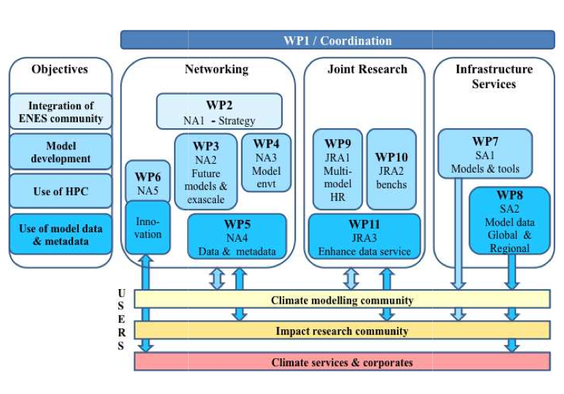

### Objectives

IS-ENES2 will:

**Foster the integration of the European Climate and Earth system modeling community**
- Strengthen ENES governance, further developing its strategy, especially with regards to model evaluation and model developments
- Stimulate interactions between global and regional climate modeling communities
Develop training

**Enhance the development of Earth System Models for the understanding of climate variability and change**
- Network on future model developments required to improve model quality and use of future computing architectures
- Stimulate common software developments and providing a service on models and tools

**Support high-end simulations enabling us to better understand and predict climate variations and change**
- Prepare for future exascale computing architectures
- Prepare multi-model high resolution common experiments on the European PRACE high-performance computer facilities
- Stimulate collaboration with ICT companies

**Facilitate the application of Earth system model simulations to better predict and understand climate change impacts on society**
- Enhance the dissemination of model results from both global and regional model experiments
- Develop an interface dedicated to the climate impact community and improving the quality of information on simulations through metadata developments and guidance to users
- Enhance interaction between the climate modelling activity and users from companies and the emerging climate services

### Partners

Organisation name (Acronyms) | Country
: ---------- : | : ---------:
[Centre National de la Recherche Scientifique (CNRS-IPSL)](https://www.cnrs.fr/)	| France
[Deutsches Klimarechenzentrum GmbH (DKRZ)](https://www.dkrz.de/de)	| Germany
[Centre Européen de Recherche et de Formation Avancée en Calcul Scientifique (CERFACS)](https://cerfacs.fr/en/) | France
[Centro Euro-Mediterraneo per i Cambiamenti Climatici	(CMCC)](https://www.cmcc.it/) |	Italy
[The University of Reading (UREAD-NCAS](http://www.reading.ac.uk/) | United-Kingdom
[The Met Office (METOFFICE)](https://www.metoffice.gov.uk/) | United Kingdom
[Science and Technology Facilities Council	(STFC)](https://www.ukri.org/councils/stfc/) | United Kingdom
[Sveriges Meteorologiska och Hydrologiska Institut (SMHI)](https://www.smhi.se/q/Stockholm/2673730) | Sweden
[Koninklijk Nederlands Meteorologisch Instituut (KNMI)](https://www.knmi.nl/home) | The Netherlands
[Max-Planck-Gesellschaft zur Förderung der Wissenschaften e.V (MPG/MPI-Met)](https://mpimet.mpg.de/startseite) |	Germany
[Climate System Analysis Group, University of Cape Town (CSAG)](https://www.csag.uct.ac.za/) | South Africa
[University of Manchester (UNIMAN)](https://www.manchester.ac.uk/) | United Kingdom
[Institutul National de Hidroligie si Gospodarire a Apelor (INHGA)](http://www.inhga.ro/) | Romania
[Wageningen Universiteit	(WU)](https://www.wur.nl/en/wageningen-university.htm) | The Netherlands 
[Linköpings Universitet (LIU)](https://liu.se/en) | Sweden
[Barcelona Supercomputing Centre (BSC)](https://www.bsc.es/) | Spain
[Universidad de Cantabria (UC)](https://web.unican.es/en/Pages/default.aspx) | Spain
[Deutsches Zentrum für Luft - und Raumfahrt in der Helmholtz Gemeinschaft (DLR)](https://www.dlr.de/EN/Home/home_node.html) | Germany
[Danmarks Meteorologiske Institut (DMI)](https://www.dmi.dk/) | Denmark
[Fundacio Institut Catala de Ciencies del Clima (IC3)](https://www.isglobal.org/) | Spain
[Météo France - Centre National de Recherches Météorologiques (MF-CNRM)](https://meteofrance.com/) | France
[Universitetet I Bergen (UiB)](https://www.uib.no/en) | Norway
[Meteorologisk Institutt (METNO)](https://www.met.no/) | Norway

### Description of Work

IS-ENES2 is structured into 11 workpackages, 5 Networking Activities (NA), 2 Service Activities (SA), 3 Joint Research Activities (JRA) and one workpackage dedicated to the project coordination & management.

*Here is a schematic representation of IS-ENES2 objectives and organisation of work packages:*

*List of IS-ENES2 Work Packages:*

**WP1: Scientific and technical coordination of IS-ENES2**
This work package will ensure an effective, smooth and high-quality implementation of the project, with respect to both general administrative and management practices that are expected for projects funded via the EC programmes, and with respect to financial management.

**Networking activities:**

**NA1 (WP2): ENES strategy**
This work package aims at strengthening the integration of the ENES community.

**NA2 (WP3): Towards next generation models**
This work package will stimulate interactions among the community to prepare future generations of climate models.

**NA3 (WP4): Earth System Modelling Environments**
This work package wil complement NA2 by focusing on the model environment tools that are required to develop, run and exploit ESMs.

**NA4 (WP5): Data Networking**
This work package wil focus on data and metadata networking.

**NA5 (WP6): Innovating on climate modelling**
This work package will focus on innovation for climate modeling.

**Service activities**

**SA1 (WP7): The European Network of geographically distributed services on Earth System models, component models and tools**
It expands from IS-ENES1 service covering a wider range of services of models, with a minimum service for all 7 CMIP5 models offering expert contact to answer specific questions on models.

**SA2 (WP8): ENES Climate Data Services**
It is the service on data from the ENES Data Federation..

**Joint research activities**

**JRA1 (WP9): Multi-model, multi-member high resolution Earth System Models**
It will prepare multi-model multi-member high-resolution simulations for PRACE machines.

**JRA2 (WP10): Performance benchmarks for coupled climate models**
It will develop benchmarks for HPC and evaluate different coupling technologies.

**JRA3 (WP11): Developing software infrastructure for data archive services**
It will further develop methodologies and tools for climate data archives and to serve climate impacts.
