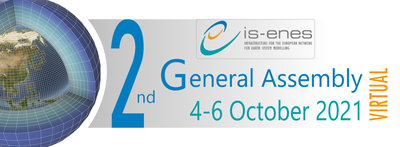
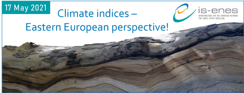

### 7th ENES HPC Workshop Barcelona 2022
- open when: **Monady, 9 May 2022**
- duration: **May 09, 2022 09:00 AM to May 11, 2022 05:00 PM (Europe/Vienna / UTC200)**

The 7th ENES HPC workshop will take place as an hybrid event at Barcelona Supercomputing Center (BSC, Barcelona) from Monday, May 9 to Wednesday, May 11 2022.

**Find all the information and registration details on the [ENES Portal](https://portal.enes.org/community/community-workshops/7th-enes-hpc-workshop-barcelona-2022)**

IS-ENES3 organises this workshop of the European Network for Earth System modelling (ENES) in collaboration with [ESiWACE2](https://www.esiwace.eu/). It will gather experts on HPC in earth system modelling at an hybrid event. A streaming service for remote participants (including speakers) will be available but after those 2 years of very scarce social interactions due to the pandemic, we strongly encourage everyone to travel and physically attend the workshop.

Building on the previous ENES HPC workshops (Lecce, 2011 & 2018; Toulouse, 2013 & 2016; Hamburg, 2014 & 2020), the talks are structured in five sessions:

Session no. | Session name
:----------:|:------------:
Session 1 | European and International HPC Landscape
Session 2 | Mix traditional modeling with Machine Learning 
Session 3 | Performance
Session 4 | Heterogeneous architectures (accelerators)
Session 5 | Data Worflows

- Agenda: you can download the detailed preliminary agenda [here](https://github.com/valeriupredoi/valeriupredoi.github.io/raw/master/pdf_documents/Preliminar-Agenda-7th-ENES-Workshop.xlsx).
- Register [here](https://docs.google.com/forms/d/e/1FAIpQLSdaTpORsHkO-OQzfG50vWFnuyhzP8hcGXWVC5hRotYtPYVqiw/viewform) before April 25th, 2022!
- In order to organise your stay, you can find the instructions to access the BSC venue [here](https://raw.githubusercontent.com/valeriupredoi/valeriupredoi.github.io/master/pdf_documents/Barcelona2022-Venue%20details.pdf) and a list of hotels in Barcelona [here](https://raw.githubusercontent.com/valeriupredoi/valeriupredoi.github.io/master/pdf_documents/Barcelona2022-Hotels%20near%20BSC.pdf).

### IS-ENES3 at EGU2022
- duration: **May 23, 2022 09:00 AM to May 27, 2022 08:00 PM (Europe/Vienna / UTC200)**

- SC5.14 - [Earth System Model Evaluation with ESMValTool in the Jupyter notebook](https://meetingorganizer.copernicus.org/EGU22/session/43187)
  - Convener: Bouwe Andela
  - Co-conveners: Fakhereh Alidoost, Carsten Ehbrecht,Peter C. Kalverla, Klaus Zimmermann
- ITS3.3/CL3.2.20 - [From vision to action: transdisciplinary approaches for providing climate change impact and adaptation information and capacity development](https://meetingorganizer.copernicus.org/EGU22/session/43594)
  - Convener: Jörg Cortekar
  - Co-conveners: Judith Klostermann,Janette Bessembinder,Stefan Kienberger
- ESSI2.7 – [Meeting Exascale Computing Challenges with Compression and Pangeo](https://meetingorganizer.copernicus.org/EGU22/session/42046)
- EGU22-7869 - CPMIP: Computational evaluation of the new era of complex Earth System Models. Multi-model results from CMIP6 and challenges for the exascale computing, by Mario Acosta and V. Balaji.
- EGU22-7151 - Storage growth mitigation through data analysis ready climate datasets using HDF5 Virtual Datasets, by Ezequiel Cimadevilla and Antonio S. Cofiño
- ESSI3.3 – [Free and Open Source Software (FOSS), Cloud-based Technologies and HPC to Facilitate Collaborative Science](https://meetingorganizer.copernicus.org/EGU22/session/42416)
- EGU22-7330 - ENES Data Space: an open, cloud-enabled data science environment for climate analysis, by Fabrizio Antonio et al.
- CL5.1.1 – [Climate Services - Underpinning Science](https://meetingorganizer.copernicus.org/EGU22/session/42621)
- EGU22-6372 - Better Tailoring of Climate Information for End Users using Targeted Interfaces and Tools, by Christian Pagé et al.
- CR6.1 – [Rapid changes in sea ice: processes and implications](https://meetingorganizer.copernicus.org/EGU22/EGU22-11971.html)
- EGU22-11971 - Emergence of a sub-ice platelet layer in mushy-layer sea ice model simulations, by Martin Vancoppenolle et al
- OS1.11 – [Under cover: The Southern Ocean’s connection to sea ice and ice shelves](https://meetingorganizer.copernicus.org/EGU22/EGU22-7257.html)
- EGU22-7257 - Drivers of Antarctic sea-ice advance date, by Kenza Himmich et al.

### 2nd Technical ESMValTool Workshop 2021
- open when: **Nov 23, 2021**
- duration: **Nov 23, 2021 10:00 AM to Nov 25, 2021 05:00 PM**

**You can find the summary report of the workshop** [here](https://raw.githubusercontent.com/valeriupredoi/valeriupredoi.github.io/master/pdf_documents/Summary_ESMValTool_Workshop_Nov_2021.pdf)

The Second Technical ESMValTool Workshop 2021 took place via video call from 23-25 November 2021 with 34 participants from BSC, DLR, Met Office, NLeSC, PML, SMHI, U Bremen and U Reading. The main goal of the workshop was to bring together the development community, discuss future strategies and provide updates on progress since the last workshop in May 2021. Specifically, the workshop included the following topics and side meetings:

- Latest developments: mamba Installation, highlights v2.4, automatic download of missing data, selection of time rages
- Native model grids and diagnostics for monitoring model runs
- Support for regional models
- Testing recipes
- Non-backward compatible changes
- General discussion
- Side meetings:
  - user engagement team
  - cross team meeting
  - pinning dependencies

### IS-ENES3 virtual 2nd General Assembly
- open when: **Oct 04, 2021**
- duration: **Oct 04, 2021 09:00 AM to Oct 06, 2021 05:00 PM (Europe/Vienna / UTC200)**

- **You can find the event report of the workshop** [here](https://raw.githubusercontent.com/valeriupredoi/valeriupredoi.github.io/master/pdf_documents/IS-ENES3_M1.4.pdf)
- **You can find the agenda of the workshop** [here](https://raw.githubusercontent.com/valeriupredoi/valeriupredoi.github.io/master/pdf_documents/Agenda_IS-ENES3_Virtual_GA2_v4.pdf)

**Table of presentations:**

##### Monday, October 4th
**9h30-12h30: Session 1 - Plenary session**

Time Slot | Author(s) and presentation
:--------:|:--------------------------:
9h30-10h15 | [Overview of IS-ENES3](https://raw.githubusercontent.com/valeriupredoi/valeriupredoi.github.io/master/pdf_documents/IS-ENES3_GA2_overview_v2.pdf) - Sylvie Joussaume & Bryan Lawrence
           | [Update on sustainability (WP2-NA1)](https://raw.githubusercontent.com/valeriupredoi/valeriupredoi.github.io/master/pdf_documents/IS-ENES_GA2_WP2-NA1_sustain.pdf) - Fanny Adloff
10h15-10h55 | [NextGEMS – Next Generation Earth Modelling Systems](https://raw.githubusercontent.com/valeriupredoi/isenes3-website-old/main/old-site/files/20211004_NextGEMSENES.pdf) - Björn Stevens, MPI-M
            | [ESM2025 – Earth System Models for the future](https://raw.githubusercontent.com/valeriupredoi/isenes3-website-old/main/old-site/files/ESM2025_ISENES3_AGM_RolandSfrian.pdf) - Roland Séférian, MF-CNRM
10h55-11h10 | [Results from the HPC survey](https://raw.githubusercontent.com/valeriupredoi/valeriupredoi.github.io/master/pdf_documents/IS-ENES3_GA2_CarbonFootprint_Action7.pdf) – Claire Lévy, IPSL-LOCEAN
            | [About the estimation of energy-cost of data transfer](https://raw.githubusercontent.com/valeriupredoi/valeriupredoi.github.io/master/pdf_documents/IS-ENES3_GA2_About_the_estimation_of_the_energy-cost_of_data_transfer.pdf) – Jean-Claude André
11h25-12h30 | General project information, budget assessment for 2022 and reallocations – Sophie Morellon & Sylvie Joussaume

**14h30-16h30: Session 2 - Model Evaluation**

Time Slot | Author(s) and presentation
:--------:|:--------------------------:
14h30-14h55 | [WP debriefings WP3-NA2, WP5-NA4, WP6-VA1, WP7-VA2, WP9-JRA2](https://raw.githubusercontent.com/valeriupredoi/valeriupredoi.github.io/master/pdf_documents/IS-ENES3_GA2_WP3_WP5_WP6_WP7_WP9.pdf) - Kim Serradell & Rémi Kazeroni
14h55-15h45 | [Survey results on model evaluation and perspectives](https://raw.githubusercontent.com/valeriupredoi/valeriupredoi.github.io/master/pdf_documents/SurveyAG_ISENES3_2021.pdf) – Jérôme Servonnat
            | [Overview of ESMValTool progress – Rémi Kazeroni](https://raw.githubusercontent.com/valeriupredoi/valeriupredoi.github.io/master/pdf_documents/IS-ENES3_GA2_ESMValTool_Kazeroni.pdf)
            | [Provenance and technical standards (WP3-NA2, WP5-NA4](https://raw.githubusercontent.com/valeriupredoi/valeriupredoi.github.io/master/pdf_documents/IS-ENES3_GA2_DiagnosticStandards_JavierVegas.pdf) – Kim Serradell & Javier Vegas
15h45-16h30 | Model Evaluation: cross-workpackage issues

##### Tuesday, October 5th
**10h-12h: Session 3 - Data, metadata and other data software**

Time Slot | Author(s) and presentation
:--------:|:--------------------------:
10h-10h25 | [WP debriefings (WP5-NA4, WP7-VA2, WP10-JRA3)](https://raw.githubusercontent.com/valeriupredoi/valeriupredoi.github.io/master/pdf_documents/IS-ENES3_GA2_WP5-WP7-WP10.pdf)
10h25-11h25 | [ESGF architecture](https://raw.githubusercontent.com/valeriupredoi/valeriupredoi.github.io/master/pdf_documents/IS-ENES3_GA2_ESGF_Architecture.pdf) – Philip Kershaw
            | [Climate4impact portal 2.0](https://raw.githubusercontent.com/valeriupredoi/valeriupredoi.github.io/master/pdf_documents/IS-ENES3_GA2_Climate4Impact.pdf) – Alessandro Spinuso
            | [Update on user requirements (including climate indices)](https://raw.githubusercontent.com/valeriupredoi/valeriupredoi.github.io/master/pdf_documents/WP_debriefing_GA2_WP3_NA2_user_requirements.pdf) – Janette Bessembinder
            | [ES-DOC](https://raw.githubusercontent.com/valeriupredoi/valeriupredoi.github.io/master/pdf_documents/IS-ENES3_GA2_ES-DOC_status_update.pdf) – Sadie Bartholomew
11h25-12h | Data, metadata and other data software: cross-workpackage issues and introduction to breakout groups

**14h30-16h30: Session 4 - Models, Tools and HPC**

Time Slot | Author(s) and presentation
:--------:|:--------------------------:
14h30-14h55 | [WP debriefings (WP4-NA3, WP6-VA1, WP8-JRA1)](https://raw.githubusercontent.com/valeriupredoi/valeriupredoi.github.io/master/pdf_documents/IS-ENES3_GA2_WP4-WP6-WP8.pdf)
14h55-15h55 | [Recent developments in XIOS](https://raw.githubusercontent.com/valeriupredoi/valeriupredoi.github.io/master/pdf_documents/AG-ISENES3-recent_developments_in_xios.pdf) – Yann Meurdesoif
            | [Update on Cylc/Rose](https://raw.githubusercontent.com/valeriupredoi/valeriupredoi.github.io/master/pdf_documents/IS-ENES3_GA2_Cylc_Rose_Update.pdf) – David Matthews
            | [Update on NEMO Sea Ice model](https://raw.githubusercontent.com/valeriupredoi/valeriupredoi.github.io/master/pdf_documents/IS-ENES3_GA2_NEMO-sea-ice_Blockley_Vancoppenolle.pdf) – Ed Blockley & Martin Vancoppenolle
            | [NEMO HPC Working Group](https://raw.githubusercontent.com/valeriupredoi/valeriupredoi.github.io/master/pdf_documents/IS-ENES3_GA2_Epicoco_NEMO_HPC-WG.pdf) – Italo Epicoco
15h55-16h35 | Models, Tools and HPC: cross-workpackage issues and introduction to breakout groups

### IS-ENES3 virtual First General Assembly
- open when: **Mar 25, 2020**
- duration: **Mar 25, 2020 to Mar 27, 2020 (Europe/Vienna / UTC100)**

The **IS-ENES3 Virtual First General Assembly** was held on the **25th-27th of March 2020**. Initially planned in Toulouse (Centre International de Conférences), the Covid-19 situation compelled the project to turn it into a remote meeting. More than 100 persons joined throughout the three days to attend presentations of the project activities (organized in sessions according to the three main themes: Data, metadata and software; Models, tools and HPC; model Evaluation) and participate to discussions on various topics.

Find the presentations within the agenda, by clicking on the title of the presentations.

**Agenda**

- **Wednesday 25th March**
*10h-13h - Session 1: Integration and sustainability*

Time Slot | Author(s) and presentation
:----------:|:--------------------------:
10h-10h15 | [Overview of IS-ENES3](https://raw.githubusercontent.com/valeriupredoi/valeriupredoi.github.io/master/pdf_documents/S11_IS-ENES3_GA1_overview.pdf) - Sylvie Joussaume & Bryan Lawrence
10h20-10h35 | [Introduction to sustainability (WP2-NA1)](https://raw.githubusercontent.com/valeriupredoi/valeriupredoi.github.io/master/pdf_documents/S12_IS-ENES3_GA1_Sustainability.pdf) - Michael Lautenschlager, Fanny Adloff
10h50-11h00 | [Introduction to user engagement](https://raw.githubusercontent.com/valeriupredoi/valeriupredoi.github.io/master/pdf_documents/S13_IS-ENES3_GA1_user_engagement_v2.pdf) - Janette Bessembinder, Eric Guilyardi
11h00-11h15 | [Downstream data usage](https://raw.githubusercontent.com/valeriupredoi/valeriupredoi.github.io/master/pdf_documents/S14_IS-ENES3_GA1_Downstream_data_usage.pdf) – Janette Bessembinder
11h45-12h05 | [Introduction to innovation (including Copernicus C3S)](https://raw.githubusercontent.com/valeriupredoi/valeriupredoi.github.io/master/pdf_documents/S15_IS-ENES3_GA1_Innovation.pdf) – Martin Juckes, Fanny Adloff
12h20-12h20 | [Preparing the RP1 report](https://raw.githubusercontent.com/valeriupredoi/valeriupredoi.github.io/master/pdf_documents/Preparing_the_Reporting_Period_1_Sophie_Morellon_v2_SJ.pdf) – Sophie Morellon
12h30-12h40 | [Autumn Data School](https://raw.githubusercontent.com/valeriupredoi/valeriupredoi.github.io/master/pdf_documents/S17_IS-ENES3_GA1_Autumn_School.pdf) – Judith Klostermann
12h40-12h50 | [Carbon Footprint working group](https://raw.githubusercontent.com/valeriupredoi/valeriupredoi.github.io/master/pdf_documents/S18_IS-ENES3_GA1_CarbonFootprint-comp.pdf) – Sophie Valcke et al.

*14h30-17h30 Session 2: Data, metadata and other software*

Time Slot | Author(s) and presentation
:----------:|:--------------------------:
14h30-14h45 | [WP debriefings: WP5-NA4, WP7-VA2, WP10-JRA3](https://raw.githubusercontent.com/valeriupredoi/valeriupredoi.github.io/master/pdf_documents/S21_IS-ENES3_GA1_WP5_WP7_WP10.pdf) - Phil Kershaw, Klaus Zimmermann, Stephan Kindermann, Wim Som de Cerff, Sandro Fiore, Christian Pagé
14h55-15h10 | [Status of ESGF for CMIP6](https://raw.githubusercontent.com/valeriupredoi/valeriupredoi.github.io/master/pdf_documents/S22_IS-ENES3_GA1_CMIP6-ESGF.pdf) - Stephan Kindermann
15h10-15h25 | [Status of ES-DOC for CMIP6](https://raw.githubusercontent.com/valeriupredoi/valeriupredoi.github.io/master/pdf_documents//S23_IS-ENES3_GA1_ES-DOC-v2.pdf) - David Hassell
15h25-15h40 | [Perspectives on possible Future architecture for ESGF](https://raw.githubusercontent.com/valeriupredoi/valeriupredoi.github.io/master/pdf_documents/IS-ENES3_GA2_CarbonFootprint_Action7.pdf) – Philip Kershaw
15h40-15h55 | [Perspectives on compute services for ESGF](https://raw.githubusercontent.com/valeriupredoi/valeriupredoi.github.io/master/pdf_documents/S25_IS-ENES3_GA1_ComputeService_Fiore.pdf) – Sandro Fiore
16h35-16h45 | [Data, metadata and other data software: presentation of cross-WP issues](https://raw.githubusercontent.com/valeriupredoi/valeriupredoi.github.io/master/pdf_documents/S26_Cross-WP_Data_Session.pdf) 

- **Thursday 26th March**
*10h-13h - Session 3: Models, Tools and HPC*

Time Slot | Author(s) and presentation
:----------:|:--------------------------:
10h-10h15 | [WP debriefings: WP4-NA3, WP6-VA1, WP8-JRA1](https://raw.githubusercontent.com/valeriupredoi/valeriupredoi.github.io/master/pdf_documents/S31_IS-ENES3_GA1_WP4_WP6_WP8.pdf) - Jean-Christophe Rioual, Mario Acosta, Uwe Fladrich, Eric Maisonnave, Sophie Valcke, Italo Epicoco
10h25-10h35 | [Cylc and Rose: latest news)](https://raw.githubusercontent.com/valeriupredoi/valeriupredoi.github.io/master/pdf_documents/S32_IS-ENES3_GA1_Cylc.pdf) - David Matthews
10h35-10h45 | [XIOS: where are we and example of use](https://raw.githubusercontent.com/valeriupredoi/valeriupredoi.github.io/master/pdf_documents/S33_IS-ENES3_GA1-XIOS.pdf) - Yann Meuredesoif
10h45-10h55 | [OASIS3-MCT latest news](https://raw.githubusercontent.com/valeriupredoi/valeriupredoi.github.io/master/pdf_documents/S34_IS-ENES3_GA1_OASIS3-MCT.pdf) – Sophie Valcke
11h20-11h35 | [European sea ice modelling integrated initiative](https://raw.githubusercontent.com/valeriupredoi/valeriupredoi.github.io/master/pdf_documents/EdBlockley_IS-ENES3-GA_March2020-trim.pdf) – Ed Blockley, Martin Vancopenolle
11h35-11h50 | [NEMO: improving performance results from IS-ENES3 and other projects (ESiWACE2, IMMERSE)](https://raw.githubusercontent.com/valeriupredoi/valeriupredoi.github.io/master/pdf_documents/S36_IS-ENES3_GA1_Epicoco_NEMO_improvements.pdf) – Italo Epicoco
11h50-12h05 | [Model performance: results for CMIP6](https://raw.githubusercontent.com/valeriupredoi/valeriupredoi.github.io/master/pdf_documents/S37_IS-ENES3_GA1_MarioAcostaCPMIP_presentation_final.pdf) – Mario Acosta
12h20-12h30 | [Models, tools, HPC: presentation of cross-WP issues](https://raw.githubusercontent.com/valeriupredoi/valeriupredoi.github.io/master/pdf_documents/S38_IS-ENES3_GA1_cross-WP-issues_ModelsToolsHPC-comp.pdf) – Sophie Valcke et al.
12h30-12h45 | Innovation for “Models, Tools and HPC” – Graham Riley
12h45-13h   | Machine learning/AI – Graham Riley

*14h30-17h30 - Session 4: Model Evaluation*

Time Slot | Author(s) and presentation
:----------:|:--------------------------:
14h30-14h50 | [WP debriefings: WP3-NA2, WP5-NA4, WP6-VA1, WP7-VA2, WP9-JRA2](https://raw.githubusercontent.com/valeriupredoi/valeriupredoi.github.io/master/pdf_documents/S41_IS-ENES3_GA1_WP3_WP5_WP6_WP7_WP9.pdf) - Eric Guilyardi, Klaus Zimmermann, Uwe Fladrich, Stephan Kindermann, Björn Brötz, Kim Serradell
15h05-15h25 | [ESMValTool (IS-ENES3 and CRESCENDO)](https://raw.githubusercontent.com/valeriupredoi/valeriupredoi.github.io/master/pdf_documents/S42_IS-ENES3_GA1_ESMValTool_Broetz.pdf) - Björn Brötz
15h25-15h40 | [Update on interfacing the CLIVAR ENSO package with ESMValTool](https://raw.githubusercontent.com/valeriupredoi/valeriupredoi.github.io/master/pdf_documents/S43_IS-ENES3_GA1_ENSO_interface.pdf) - Eric Guilyardi, Javier Vegas-Regidor, Kim Serradell, Yann Planton
16h10-16h20 | [Model Evaluation: Presentation of cross-workpackage issues](https://raw.githubusercontent.com/valeriupredoi/valeriupredoi.github.io/master/pdf_documents/S44_IS-ENES3_GA1_Evaluation_breakout_group.pdf)

- **Friday 27th March**
*10h-13h Session 5: Cross-WP issue discussions*

Data, metadata and other software

Time Slot | Author(s) and presentation
:----------:|:--------------------------:
10h-11h | Model Evaluation, C4I and link with the Compute Service – Björn Brötz, Christian Pagé
11h-12h | ENES CDI – Sandro Fiore, Stephan Kindermann
12h-13h | ESGF Future Architecture – Mario Acosta

 Models, tools and HPC
 
Time Slot | Author(s) and presentation 
:-----------:|:--------------------------:
10h-11h30 | XIOS benchmarks – Sophie Valcke, Mario Acosta
11h30-13h | Computational evaluation of ESMs, including coupling issues (LUCIA) and energy consumption – Mario Acosta

*14h/14h30-16h/16h30 - Session 6: “Around coffee” parallel discussions*

Time Slot | Author(s) and presentation
:----------:|:--------------------------:
14h30-16h | Carbon footprint group - Sophie Valcke
14h30-15h15 | Copernicus and climate projections - Martin Juckes 
15h15-16h30 | Climate indices standards - Lars Bärring, Christian Pagé 

### Workshop Climate Indices-Eastern European perspective
**Sep 27, 2021** from 11:00 AM to 03:00 PM

The IS-ENES3 consortium organizes an online workshop ‘Climate indices - Eastern European perspective’. The workshop will **be an online effort to collect information on the current status about usage and implementation of different climate indices in the region, which will be the starting point to draft requirements and recommendations for the future**. It will be organized as two online meetings, combined with online surveys and online interviews between them.

- **Initial meeting**: 17th May, 2021 (9:30 AM to 12:00 PM CEST)
- **Survey and interview** : June and July, 2021
- **Final workshop**: 27th September, 2021 (11:00 AM to 3:00 PM CEST)

**The aim of the workshop?** Used by a broad user community for many applications outside the climate science community, climate indices provide compact information on key physical parameters. A reference specification of the indices has been developed by joint CCl/CLIVAR/JCOMM Expert Team (ET) on Climate Change Detection and Indices (ETCCDI), and these have been implemented in the ICCLIM tool and many others. The workshop will evaluate and review the usage of existing indices and explore the need for additional ones in these broader and new communities.

**Who organizes it?**  Researchers from the IS-ENES3 consortium. These researchers will interact directly with the workshop participants. Beside many activities, IS-ENES3 project aims at further engaging with the community of users of IS-ENES services, by widening the user base through training, engaging the community in co-constructing standards and expressing needs, and engaging the younger generation in interdisciplinary approaches.

**For whom?** This workshop is for climate scientists and researchers from different disciplines (agriculture, forestry, water resources, public health etc) that often use different climate indices. We aim to create a mix of different disciplines so that recommendations will follow needs from broad research communities.

**What is the programme?** The initial online meeting will be organized to present the main goals and planned output of the final workshop together with the discussion on current status and potential future developments. After the meeting the online survey will be initialized together with online interviews, from which a set of recommendations will be drafted. The topics related to the climate indices that will be covered are: indices definition and usage, data sources, software for calculation and visualization, current gaps and limitations.

Contact: vdj[at]ff.bg.ac.rs

***Find the final report "M3.5 - Workshop on climate indice - Eastern Europe perspective" [here](https://raw.githubusercontent.com/valeriupredoi/valeriupredoi.github.io/master/pdf_documents/IS-ENES3_M3.5_vf.pdf)***

-  **Presentations from the initial meeting (May 17th)**

Presentation | Author(s) 
:-----------:|:---------:
[IS-ENES3 project introduction](https://raw.githubusercontent.com/valeriupredoi/valeriupredoi.github.io/master/pdf_documents/01_JoussaumeS_IS-ENES_European_research_infrastructure_for_Earth_System_Models_s.pdf) | WP debriefings (WP4-NA3, WP6-VA1, WP8-JRA1)
[Indices workshop goals](https://raw.githubusercontent.com/valeriupredoi/valeriupredoi.github.io/master/pdf_documents/02_DjurdjevicV_Indices_workshop_goals.pdf) | Vladimir Djurdjevic (FPUB)
[ETCCDI indices: recap and usage examples](https://raw.githubusercontent.com/valeriupredoi/valeriupredoi.github.io/master/pdf_documents/03_BarringL_Climate_indices_latest_developments_and_application_examples_s.pdf) | Lars Bärring (SHMI)
[ICCLIM and Climate4impact tool](https://raw.githubusercontent.com/valeriupredoi/valeriupredoi.github.io/master/pdf_documents/04_PageC_ICCLIM_and_Climate4impact_Tool.pdf) | Christian Pagé (CERFACS)
[Regional perspective: Previous analysis (presentation of ORIENTGATE survey and analysis report)](https://raw.githubusercontent.com/valeriupredoi/valeriupredoi.github.io/master/pdf_documents/05_KrzicA_Regional_perspective_Previous_analysis_ORIENTGATE_survey_and_analysis_report.pdf) | Aleksandra Krzic (RHMSS/FPUB)
[Next steps: survey, interviews and the planned content of the final report](https://raw.githubusercontent.com/valeriupredoi/valeriupredoi.github.io/master/pdf_documents/06_DjurdjevicV_Next_steps.pdf) | Vladimir Djurdjevic (FPUB)

- **Presentations from the final meeting (September 27th)**

Presentation | Author(s) 
:-----------:|:---------:
[Workshop Climate indices - past activities and next steps](https://raw.githubusercontent.com/valeriupredoi/valeriupredoi.github.io/master/pdf_documents/1_Workshop_Climate_indices_past_activities_and_next_steps.pdf) | Vladimir Djurdjevic (FPUB)
[Changes in temperature extremes in Romania](https://raw.githubusercontent.com/valeriupredoi/valeriupredoi.github.io/master/pdf_documents/2_Changes_in_temperature_extremes_in_Romania.pdf) | Adina-Eliza Croitoru et al. (1) Babes-Bolyai University, Romania; 2) JRC, Italy)
[Application of Climate Indices in the Regional Climatology over Southeast Europe](https://raw.githubusercontent.com/valeriupredoi/valeriupredoi.github.io/master/pdf_documents/3_Application_of_Climate_Indices_in_the_Regional_Climatology_over_Southeast_Europe.pdf) | Hristo Chervenkov (National Institute of Meteorology and Hydrology, Bulgaria)
[Use of Climate Indices in R. N. Macedonia: ClimDex and ClimPACT](https://raw.githubusercontent.com/valeriupredoi/valeriupredoi.github.io/master/pdf_documents/4_Use_of_Climate_Indices_in_R_N_Macedonia_ClimDex_and_ClimPACT.pdf) | Aleksandar D. Prodanov (National Hydrometeorological Service, N. Macedonia)
[Sectoral climate indices studies in Turkey](https://raw.githubusercontent.com/valeriupredoi/valeriupredoi.github.io/master/pdf_documents/5_Sectoral_climate_indices_studies_in_Turkey.pdf) | Serhat Şensoy (Turkish State Meteorological Service)
[Operational use of climate indices in RHMSS](https://raw.githubusercontent.com/valeriupredoi/valeriupredoi.github.io/master/pdf_documents/6_Operational_use_of_climate_indices_in_RHMSS.pdf) | Dragan Mihic (Republic Hydrometeorological Service, Serbia)
[Climate indices - Presentation of the survey results](https://raw.githubusercontent.com/valeriupredoi/valeriupredoi.github.io/master/pdf_documents/7_Climate_indices_Presentation_of_the_survey_results.pdf) | Aleksandra Krzic (RHMSS/FPUB)
[Climate indices report - main conclusions](https://raw.githubusercontent.com/valeriupredoi/valeriupredoi.github.io/master/pdf_documents/8_Climate_indices_report_main_conclusions.pdf) | Vladimir Djurdjevic (FPUB)

### IS-ENES3 Virtual workshop on requirements for a fast and scalable evaluation workflow
- duration: **May 18, 2021 02:00 PM to May 19, 2021 06:00 PM (Europe/Vienna / UTC200)**

### IS-ENES3 webinar on the Access on CORDEX and CMIP6 climate data
- duration: **Jun 15, 2020 from 10:00 AM to 11:30 AM (Europe/Vienna / UTC200)**

### IS-ENES3 Kick-off Meeting
- duration: **Jan 09, 2019 01:00 PM to Jan 11, 2019 01:30 PM (Europe/Vienna / UTC100)**

### IS-ENES3 and ESGF Virtual Workshop on Compute and Analytics

*TODO Section Needs completion* - **listing all workshops and adding detailed info**
