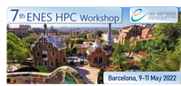

### Current

#### 7th ENES HPC Workshop (Barcelona, 2022)
- open when: **Monady, 9 May 2022**
- duration: **May 09, 2022 09:00 AM to May 11, 2022 05:00 PM (Europe/Vienna / UTC200)**

The 7th ENES HPC workshop will take place as an hybrid event at Barcelona Supercomputing Center (BSC, Barcelona) from Monday, May 9 to Wednesday, May 11 2022.

**Find all the information and registration details on the [ENES Portal](https://portal.enes.org/community/community-workshops/7th-enes-hpc-workshop-barcelona-2022)**

IS-ENES3 organises this workshop of the European Network for Earth System modelling (ENES) in collaboration with [ESiWACE2](https://www.esiwace.eu/). It will gather experts on HPC in earth system modelling at an hybrid event. A streaming service for remote participants (including speakers) will be available but after those 2 years of very scarce social interactions due to the pandemic, we strongly encourage everyone to travel and physically attend the workshop.

Building on the previous ENES HPC workshops (Lecce, 2011 & 2018; Toulouse, 2013 & 2016; Hamburg, 2014 & 2020), the talks are structured in five sessions:

Session no. | Session name
:----------:|:------------:
Session 1 | European and International HPC Landscape
Session 2 | Mix traditional modeling with Machine Learning 
Session 3 | Performance
Session 4 | Heterogeneous architectures (accelerators)
Session 5 | Data Worflows

- Agenda: you can download the detailed preliminary agenda [here](https://github.com/valeriupredoi/valeriupredoi.github.io/raw/master/pdf_documents/Preliminar-Agenda-7th-ENES-Workshop.xlsx).

Register [here](https://docs.google.com/forms/d/e/1FAIpQLSdaTpORsHkO-OQzfG50vWFnuyhzP8hcGXWVC5hRotYtPYVqiw/viewform) before April 25th, 2022!

In order to organise your stay, you can find the instructions to access the BSC venue [here](https://raw.githubusercontent.com/valeriupredoi/valeriupredoi.github.io/master/pdf_documents/Barcelona2022-Venue%20details.pdf) and a list of hotels in Barcelona [here](https://raw.githubusercontent.com/valeriupredoi/valeriupredoi.github.io/master/pdf_documents/Barcelona2022-Hotels%20near%20BSC.pdf).

####
